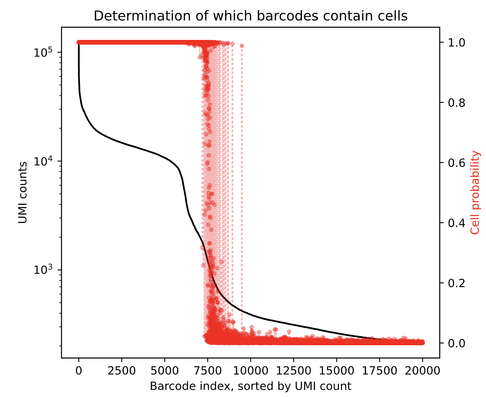

# Single Cell Sequencing Data Analysis with Scanpy

## Table of Contents

1. [Description and Acknowledgements](#description)
2. [Libraries](#libraries)
3. [Finding Public Data](#finding-public-data)
4. [Data Download](#data-download)
5. [Quality Control: FastQC](#fastqc)
6. [Read Processing and Alignment: CellRanger](#read-processing-and-alignment-cellranger)
7. [Technical Artifact Removal: CellBender](#technical-artifact-removal-cellbender)
8. [Loading Single-Cell RNA-seq Count Data: Scanpy](#loading-single-cell-rna-seq-count-data-scanpy)
9. [Doublet Prediction: scvi](#doublet-prediction-scvi)
9. [Pre-Processing Single-Cell RNA-seq Count Data: Scanpy](#pre-processing-single-cell-rna-seq-count-data-scanpy)

## Description and Acknowledgements

The "Single Cell Sequencing Data Analysis with Scanpy" project aims to evaluate publicly available single cell sequencing data from the Sequence Read Archive (SRA) database using the powerful `scanpy` library. This project will encompass the entire data analysis workflow, from data discovery and retrieval to the final evaluation using `scanpy`.

This work is largely based on work done by Dr. Hamid Ghaedi [here](https://github.com/hamidghaedi/scRNA_seq-analysis/blob/main/README.md)

## Libraries

- [Entrez Direct](https://www.ncbi.nlm.nih.gov/books/NBK179288/)
- [SRA Toolkit](https://github.com/ncbi/sra-tools/wiki)
- [Fastqc](https://www.bioinformatics.babraham.ac.uk/projects/fastqc/) 
- [Cell Ranger](https://support.10xgenomics.com/single-cell-gene-expression/software/pipelines/latest/using/tutorial_ov)
- [Apptainer](https://apptainer.org/docs/user/main/docker_and_oci.html)
- [Docker](https://www.docker.com/)
- [CellBender](https://cellbender.readthedocs.io/en/latest/)
## Finding Public Data

The Sequence Read Archive ([SRA](https://www.ncbi.nlm.nih.gov/sra)) is a publically accessible database maintained by the National Center for Biotechnology Information ([NCBI](https://www.ncbi.nlm.nih.gov)) containing vast archives of bioinformatic sequencing data. As such, it is a great place to start looking for publically available sequencing data that may be useful to answer your research question. In my case, I would like to find a **single-cell sequencing** dataset of **human bladder cancer samples**.  

Thankfully, the SRA database can be searched for 'key terms' using the `esearch` command from the [Entrez Direct](https://www.ncbi.nlm.nih.gov/books/NBK179288/) command line tool. Entrez Direct can be downloaded by running the following commands (as outlined [here](https://www.ncbi.nlm.nih.gov/books/NBK179288/)) :

1. `sh -c "$(curl -fsSL https://ftp.ncbi.nlm.nih.gov/entrez/entrezdirect/install-edirect.sh)"`
2. `echo "export PATH=\$HOME/edirect:\$PATH" >> $HOME/.bash_profile`
3. `export PATH=${HOME}/edirect:${PATH}`

** After Entrez Direct is downloaded approriately, you will need to restart your terminal session

With Entrez Direct downloaded you can run the following command replacing `<Key Terms>` with your own. This function will query the SRA database looking for datasets matching your search criteria and store those results in a .csv file to be viewed in Excel (or perfered editor). 

`esearch -db sra -query '<Key Terms>' | efetch -format runinfo > sra_results.csv`

Note: like all search queries, there are effective modes of setting search criteria or `<Key Terms>` in the SRA ([documentation here](https://www.ncbi.nlm.nih.gov/sra/docs/srasearch/)). For example, to find the single cell sequencing reads from all human bladder cancer samples in the SRA my search may look like the following:

`<Key Terms>` = ((((Homo sapiens[Organism]) AND Single Cell Sequencing)) AND Bladder Cancer)

When I run the above `esearch` command using the above `<Key Terms>` I get the following spread sheet: 


This spread sheet contains an abundance of information regarding all data samples in the SRA that match your search criteria. I would recommend that you sort the spreadsheet by the `"BioProject"` column, and begin manually searching the `"BioProject"` of interest in the SRA database. For example, the `"BioProject"` of most interest to me has the ID `"PRJNA558456"` so I would search the [NCBI](https://www.ncbi.nlm.nih.gov) database as follows:


** Note: please read all the documentation and attached publications to verify the data is as you expect it. If it is we can begin to download all of the samples contained within the selected `"BioProject"`. To do so, I like to download a RunInfo table similar our previously generated `esearch` table above; however, this table will only contain information from our selected `"BioProject"` this can be done by running the following (Replacing `<BioProject>` with your selected Bioproject ID): 

`esearch -db sra -query <BioProject>  | efetch --format runinfo > runinfo.csv`

When I run this script for my BioProject `PRJNA558456` I get the following **runinfo.txt** file: 


## Data Download

As seen [here](https://www.biostars.org/p/359441/#360008) using this runinfo file, we can download SRA data in parallel (GNU) using the [SRA toolkit](https://github.com/ncbi/sra-tools/wiki). 

to download the SRA toolkit please follow the appropriate instructions [here](https://github.com/ncbi/sra-tools/wiki/02.-Installing-SRA-Toolkit)

Once downloaded you will need to configure your SRA toolkit using the following command 

`vdb-config -i`

this will open an interactive screen you can navigate with your arrow keys and enter.


navigate to `Cache` tab and input a path to an empty directory that will accept all the fastq files from your selected BioProject. In my case, this path is:  `lustre06/project/6065374/garvena/singlecellseq/Data/InputData/Lai`


Once SRA-toolkit is configured you can 'bulk download' all fastq files from the bioproject of interest using the following command: (please change `<number of samples>` and `<path to runinfo.txt>` to match your data download)


```bash
#!/bin/bash

module load sra-toolkit/3.0.0

parallel --verbose -j 8 curl {} ::: $(tail -n +2 /home/garvena/projects/def-dmberman/garvena/singlecellseq/Data/InputData/test/runinfo.csv | cut -d ',' -f10) >> sra_dump.log
wait
exit
```

## Quality Control: FastQC

Running Quality Control on fastq files downloaded from a public repository is always a good idea. for this I typically use the [fastqc](https://www.bioinformatics.babraham.ac.uk/projects/fastqc/) module. to download fastqc please follow instructions outlined [here](https://raw.githubusercontent.com/s-andrews/FastQC/master/INSTALL.txt)


Once installed you can run the following code changing:
1.  `<path/to/fastq>` with the path to the directory containing the subdirectories with fastq files downloaded above
2. `<path/to/fastQCoutput>` with the path you wish to download the fastqc output
3. `<NumberOfThreads>` with an integer regarding the number of Threads available to multi-thread this process. 


```bash
module load fastqc

fastqc <path/to/fastq>/*/*.fastq.gz -o <path/to/fastQCoutput>/fastQC -f fastq -t <numberOfThreads>
```

fastqc will return 2 files for each sample:

1. ID_fastqc.html
2. ID_fastqc.zip

open the ID_fastqc.html file in your prefered browser by running one of the following commands
1. Google Chrome 

```bash
google-chrome ID_fastqc.html
```
2. Firefox 

```bash
firefox ID_fastqc.html
```

3. Simply locate the file on your device and double click to open in default browser.

This will open up a fastqc report containing a variety of QC metrics for each sample as seen below

 

please navigate through all the summary statistics provided on the right hand side including: Basic Statistics, Per base sequence quality, etc.

## Read Processing and Alignment: CellRanger

Assuming all downloaded fastq files pass quality control checks, we are ready to align and quantify the single-cell sequencing RNA transcripts. This process will be done using [CellRanger](https://support.10xgenomics.com/single-cell-gene-expression/software/pipelines/latest/what-is-cell-ranger) (Note: CellRanger requires 10X Genomics data as input) 

CellRanger has very strict input requirements, and as such we need to download additional data and further preprocess our data to meet these requirements:

1. [Download CellRanger](#download-cell-ranger)
2. [Rename Fastq Files](#rename-fastq-files)
3. [Download Reference Genome](#download-reference-genome)
4. [Find Chemistry Type](#find-chemistry-type)

### Download Cell Ranger

cellranger can be downloaded by following the instructions provided by 10X genomics [here](https://support.10xgenomics.com/single-cell-gene-expression/software/pipelines/latest/using/tutorial_in).

in brief:

1. you download the binarys by running

```bash
#!/bin/bash
curl -o cellranger-7.1.0.tar.gz "https://cf.10xgenomics.com/releases/cell-exp/cellranger-7.1.0.tar.gz?Expires=1690612992&Policy=eyJTdGF0ZW1lbnQiOlt7IlJlc291cmNlIjoiaHR0cHM6Ly9jZi4xMHhnZW5vbWljcy5jb20vcmVsZWFzZXMvY2VsbC1leHAvY2VsbHJhbmdlci03LjEuMC50YXIuZ3oiLCJDb25kaXRpb24iOnsiRGF0ZUxlc3NUaGFuIjp7IkFXUzpFcG9jaFRpbWUiOjE2OTA2MTI5OTJ9fX1dfQ__&Signature=jqvvJ~lrWzNspxFCdtzBBXz9SIfKS6G31AlqGmj0RMXXoRoPkRfow4StdJkKSQHdillHZX6QEJThl5UaPqiz9dwfVQl~fs2iJA9jVuyvTXzs1VSuboKtNXzESUvbsfEWj3Xt0DykD-V6zeQnbprM397ENlkBvbeUxjRK-HtmMdUCb9K4BlcoXZbB0X7MwrlQNYp1CWxPXT4fIb0Q2aqAPuFGU5DfEyMXzK~hNuOmeQeMye6uF6GPaRHWFN53A6axWsIf55PHmMVQIsLPtGLVkVKMWTOzslvW8mA45lkbVFmlvqZJwfX-zUCWigmnstDUJdKQMBcR27KjxeLbG2aE7Q__&Key-Pair-Id=APKAI7S6A5RYOXBWRPDA"
```

unpack those binaries in an appropriate location by running

```bash
#!/bin/bash
tar -xzvf cellranger-7.1.0.tar.gz
```

then prepend your cell ranger directory to your path by running:

*** note change `<path/to/cellranger>` with the location of the binary download above

```bash
#!/bin/bash
export PATH=<path/to/cellranger>/cellranger-7.1.0:$PATH
```

### Rename Fastq Files

As highlighted by [Hamid](https://github.com/hamidghaedi/scRNA_seq-analysis/blob/main/README.md) and a 10X blog post [here](https://kb.10xgenomics.com/hc/en-us/articles/115003802691), natively downloaded SRA files using the fastq-dump have an incompatable file name with cellranger as shown below: 


therefore, we need to rename our `SRR*_1.fastq.gz` file to something like `SRR*_S1_L00*_*_001.fastq.gz` this can be done using the following script. you will need to change `<path/to/input/directory>` to the directory contain the raw fastq files downloaded previously. 

```bash
#!/bin/bash

# Set the path to the parent directory containing the subdirectories (directories with data)
data_dir=<path/to/inputdata/directory>

# Change to the data directory
cd "$data_dir"

# Loop through the subdirectories
for subdir in */; do
    echo "Processing files in $subdir"

    # Change to the subdirectory
    cd "$subdir"

    # Loop through the files and rename them
    for file in *.fastq.gz; do
        if [[ $file == *_S1_L*_R1_* ]]; then
            new_name="${file/_S1_L*_R1_/_R1_}"
        elif [[ $file == *_S1_L*_R2_* ]]; then
            new_name="${file/_S1_L*_R2_/_R2_}"
        else
            echo "Skipping file: $file (Unexpected filename format)"
            continue
        fi

        # Rename the file
        mv "$file" "$new_name"
        echo "Renamed: $file -> $new_name"
    done

    # Change back to the parent directory for the next subdirectory
    cd "$data_dir"
done
```

If executed correctly your data structure should look like the following:


### Download Reference Genome

As cellranger can be run for a variety of model organisms including: mice (Mus musculus), humans (Homo Sapiens), etc. it is important that we provide cellranger with an appropriate reference genome. All stable reference genomes are provided [here](https://support.10xgenomics.com/single-cell-gene-expression/software/downloads/latest) by 10X genomics, please select the most up-to-date reference. For me (August 2023) I can download the most recent GRCh38 Human reference genome by running the following

```bash 
#!/bin/bash
curl -O https://cf.10xgenomics.com/supp/cell-exp/refdata-gex-GRCh38-2020-A.tar.gz
```

and unpacked by running the following:

```bash 
#!/bin/bash
tar -xzvf refdata-gex-GRCh38-2020-A.tar.gz
```

### Find Chemistry Type

This final step requires reading the publication that the data was derived from to evaluate the sequencing chemistry used in the generation of your dataset (often found in the supplemental data). In my case this was found to be `SC3Pv3`; however, this will differ for every dataset (documentation [here](https://kb.10xgenomics.com/hc/en-us/articles/115003764132-How-does-Cell-Ranger-auto-detect-chemistry-)). 

alternatively, you can set this parameter to `auto` and cellranger will attempt to resolve the chemistry for you. 

### Running Cell Ranger

we are now ready to run cellranger on our samples. to do so run the following command inputting the appropriate: 

1. `<path/to/raw/fastq>`
2. `<path/to/ref-genome>`
3. `<chemistry/type>`

*** note this process requires a significant amount of RAM (over 300Gb for my samples) for a long period of time (over 32 hours for my samples)

```bash 
#!/bin/bash
module load cellranger

for d in <path/to/raw/fastq>/*

do
cellranger count --id=$(basename "$d") \
                 --transcriptome=<path/to/ref-genome>/refdata-gex-GRCh38-2020-A \
                 --fastqs=$d \
                 --chemistry=<chemistry/type>
done
```

when cellranger has run correctly on a sample you will receive a message saying:

`Pipestance completed successfully!` 

upon recieveing this message for each sample, you should recieve the output from cellranger in the form of a directory with the same structure as indicated below: 


with the `/outs` directory within each sample directory you should have the files of most interest including directories containing `filtered_feature_bc_matrix` and `raw_feature_bc_matrix`.

Inside the `filtered_feature_bc_matrix` and `raw_feature_bc_matrix` directories, you may find the following files:

1. `matrix.mtx`: This is the main file containing the digital gene-barcode matrix in a sparse format. It represents the number of UMIs (unique molecular identifiers) detected for each gene in each cell.
2. `features.tsv`: This file provides information about the gene features (genes) included in the matrix. It typically includes the gene names and other relevant metadata.
3. `barcodes.tsv`: This file contains information about the cell barcodes used to uniquely identify each cell in the matrix.

These files are what are going to be leveraged for Scanpy Analysis.

*** note: there are a variety of useful outputs for a whole number of things that may be covered at a later date. for now, feel free to evaluate these outputs on your own (documentation [here](https://support.10xgenomics.com/single-cell-gene-expression/software/pipelines/latest/using/tutorial_ct))

## Technical Artifact Removal: CellBender

Single-cell sequencing assays produce a significant amount of background noise counts primarily derived from cell-free droplets containing RNA fragments. This can result in a variety of errors including batch effects, incorrect differential expression, etc. As a result, we need to remove this background 'noise' from each of our samples. This can be done using [CellBender](https://github.com/broadinstitute/CellBender) ([publication](https://www.biorxiv.org/content/10.1101/791699v2), [documention](https://cellbender.readthedocs.io/en/latest/)) CellBenders main functionality `remove-background` is a module that removes counts due to ambient RNA molecules and random barcode swapping from (raw) UMI-based scRNA-seq gene-by-cell count matrices.

1. [Download CellBender](#download-cellbender)
2. [Run remove-background](#run-remove-background)

### Download CellBender
CellBender is most easily downloaded as a docker image as this will automatically download all dependancies. Thankfully, CellBender is available from the Google Container Repository. This can be downloaded via any process capable of pulling docker images; for this I will use apptainer:

***note: this is pulling the latest cellbender docker image (August 2023) and therefore will likely in the future

```bash
module load apptainer
apptainer pull cellbender.sif docker://us.gcr.io/broad-dsde-methods/cellbender:latest 
```

### Run remove-background

Remove background attempts to remove RNA reads stemming from the 'ambient plateau'. this plateau simply refers to the section of the counts-per-droplets VS. Droplet ID ranked by count plot (examples below) where the 'cells' seem to exibit significantly less RNA reads. This isnt always a low amount (see exibit B: high background); however, it should be a signifcant decrease in expression campared to other cells in the plot. this section of the plot represents what is not likely to be a cell, but instead a droplet containing a significant amount of RNA fragments. Again, if the top left portion of this plot represents a probability of being a cell, then the 'plateau' section of this graph is highly unlikely to be a true cell count as its expression is too greatly reduced and therefore likely represents an artifact. 


properly interpreting these graphs is extremely important for maximising the utility of cellbender as the `remove-background` function requires setting an `expected-cells` and `total-droplets included` values. 

Thankfully `cellranger` provides a UMI-curve as an output from within the `web_summary.html` output file. This file provides a bunch of useful information including an estimated cell count, mean reads per cell. For our purposes we simply need `Estimated Number of Cells` and a rough estimate of the middle of the `ambient plateau` these values will represent `expected-cells` and `total-droplets included values` for cellbender. For example, in the sample provided below I would set these values to ~8k and ~15K, repectively. please note that we will be running cellbender in a for loop, so we will need a rough average values for all your samples (round up)!


to run cellbender from the docker image you will need to run `module load apptainer` then make use of the exec function to execute cellbender. please adjust the `<path/to/cellranger/*.h5>` and `<path/to/cellbender/output.h5>` to the appropriate directories. In addition, please adjust `expected-cells` and `total-droplets-included` as described above. please note: the `--cuda` tag allows cellbender to utilize a GPU which signifcantly reduces the time it takes to run this opperation. if you do not have access to a GPU, please remove this tag. 

***Note: you must use the apptainer --bind tag to access filepaths outside of the docker image (this would include all data for processing)

```bash
module load apptainer 

# Set the root directory where the subdirectories with raw_feature_bc_matrix.h5 files are located
input_directory="<path/to/input/data/directory>"
output_directory="<path/to/desired/output/directory>"

# Iterate through each subdirectory and process the raw_feature_bc_matrix.h5 file
for subdir in "$input_directory"/*; do
  # Check if the raw_feature_bc_matrix.h5 file exists in the current subdirectory
  if [ -f "$subdir/outs/raw_feature_bc_matrix.h5" ]; then
    sample=$(basename "$subdir")
    
    # Process the raw_feature_bc_matrix.h5 file in the current subdirectory
    apptainer exec -C -W ${SLURM_TMPDIR} --nv \
      --bind "$input_directory":"/mnt/input" \
      --bind "$output_directory":"/mnt/output" \
      cellbender.sif cellbender remove-background \
      --input "/mnt/input/$(basename "$subdir")/outs/raw_feature_bc_matrix.h5" \
      --output "/mnt/output/$sample.h5" \
      --cuda \
      --expected-cells 8000 \
      --total-droplets-included 20000 \
      --fpr 0.01 \
      --epochs 150
  fi
done
```

CellBender has a variety of inputs for each sample including '<sample_name>_filtered.h5' which will be utilized in downstream analyses. Before proceeding please investigate the '<sample_name>.pdf' document as this contains much of the quality control outputs. Most important of which is the UMI plot from above with the overlayed prediction made by the CellBinder software. Please variefy that the cells removed from your downstream analysis (show a low probability of being a cell) seems reasonable to you. An example from my dataset is shown below. 



## Loading Single-Cell RNA-seq Count Data: Scanpy

[Scanpy](https://github.com/scverse/scanpy) (as noted by there team) is a scalable toolkit for analyzing single-cell gene expression data. It includes methods for preprocessing, visualization, clustering, pseudotime and trajectory inference, differential expression testing, and simulation of gene regulatory networks. Its Python-based implementation efficiently deals with data sets of more than one million cells. 

As this data is highly interactive, requiring multiple intermediate steps I highly recommend use of a jupyter-notebook (a working example of which can be found at */PythonScripts/main.ipynb)

This may not accurately represent all required dependancies (will update as I go)
```python 
import scanpy as sc
import anndata as ad
import pandas as pd
import numpy as np
import matplotlib.pyplot as plt
import seaborn as sns
import multiprocessing as mp
import scipy.stats as stats
from glob import glob
```

Scanpy has weird default values that are often immediately changed by convention. The first is that scanpy by default will only show warning+error messages. We would like to change this as it also offers 'Hints' if you set verbosity to 3.

```python
sc.settings.verbosity = 3
```
Here we are simply iterating through all of the '*/outs/filtered_feature_bc_matrix' directories and importing the single cell dataset into a scanpy object. 

1. I generate a list of directory paths to cellranger output directories
2. I generate a dictionary containing anndata objects with sample_name as  `keys`

*** setting cache=True will significantly speed up reloading these objects a second time and will generate additional `.h5ad` files in the directory where this code is executed. 

```python
dirpaths = glob('<path/to/cellranger/output>/*/outs/filtered_feature_bc_matrix')
adatas = {dirpath.split('/')[10]: sc.read_10x_mtx(dirpath, var_names='gene_symbols', cache=True) for dirpath in dirpaths}
```
## Doublet Prediction: scvi


## Pre-Processing Single-Cell RNA-seq Count Data: Scanpy


making an integrated anndata object containing all samples

```python
adata = ad.concat(adatas, label='sample')
adata.obs_names_make_unique
adata.var_names_make_unique
```

A common first pre-processing step is to evaluate top gene expression in your samples, to ensure they align with what you would expect within your samples. It is often difficult to see these distributions because they are heavily right skewed so I like to include the `log=True` tag to show log transformed data. please note the x-axis is log transformed (as displayed below).

```python
sc.pl.highest_expr_genes(adata, n_top=20, show=True, log=True)
```


