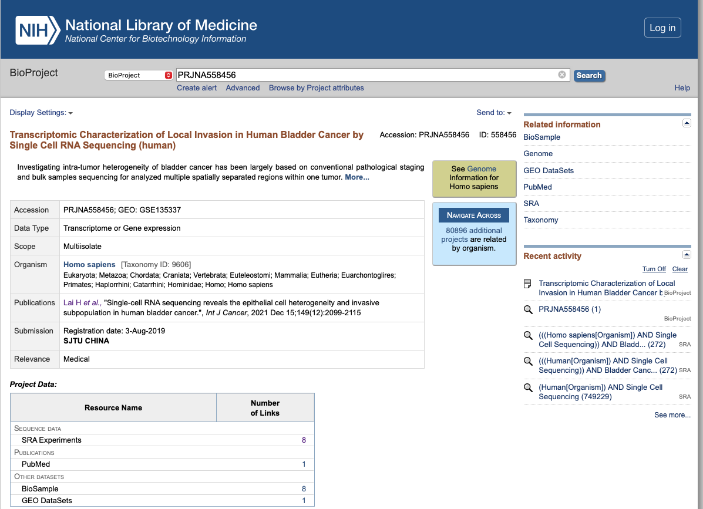

# Single Cell Sequencing Data Analysis with Scanpy

## Table of Contents

1. [Description and Acknowledgements](#description)
2. [Libraries](#libraries)
3. [Finding Public Data](#finding-public-data)

## Description and Acknowledgements

The "Single Cell Sequencing Data Analysis with Scanpy" project aims to evaluate publicly available single cell sequencing data from the Sequence Read Archive (SRA) database using the powerful `scanpy` library. This project will encompass the entire data analysis workflow, from data discovery and retrieval to the final evaluation using `scanpy`.

This work is largely based on work done by Dr. Hamid Ghaedi [here](https://github.com/hamidghaedi/scRNA_seq-analysis/blob/main/README.md)

## Libraries

- [Fastqc](https://www.bioinformatics.babraham.ac.uk/projects/fastqc/) 
- [Cell Ranger](https://support.10xgenomics.com/single-cell-gene-expression/software/pipelines/latest/using/tutorial_ov)

## Finding Public Data

### SRA Key Term Search

The Sequence Read Archive ([SRA](https://www.ncbi.nlm.nih.gov/sra)) is a publically accessible database maintained by the National Center for Biotechnology Information ([NCBI](https://www.ncbi.nlm.nih.gov)) containing vast archives of bioinformatic sequencing data. As such, it is a great place to start looking for publically available sequencing data that may be useful to answer your research question. In my case, I would like to find a **single-cell sequencing** dataset of **human bladder cancer samples**.  

Thankfully, the SRA database can be searched for 'key terms' using the `esearch` command from the [Entrez Direct](https://www.ncbi.nlm.nih.gov/books/NBK179288/) command line tool. Entrez Direct can be downloaded by running the following commands (as outlined [here](https://www.ncbi.nlm.nih.gov/books/NBK179288/)) :

1. `sh -c "$(curl -fsSL https://ftp.ncbi.nlm.nih.gov/entrez/entrezdirect/install-edirect.sh)"`
2. `echo "export PATH=\$HOME/edirect:\$PATH" >> $HOME/.bash_profile`
3. `export PATH=${HOME}/edirect:${PATH}`

** After Entrez Direct is downloaded approriately, you will need to restart your terminal session

With Entrez Direct downloaded you can run the following command replacing `<Key Terms>` with your own. This function will query the SRA database looking for datasets matching your search criteria and store those results in a .csv file to be viewed in Excel (or perfered editor). 

`esearch -db sra -query '<Key Terms>' | efetch -format runinfo > sra_results.csv`

Note: like all search queries, there are effective modes of setting search criteria or `<Key Terms>` in the SRA ([documentation here](https://www.ncbi.nlm.nih.gov/sra/docs/srasearch/)). For example, to find the single cell sequencing reads from all human bladder cancer samples in the SRA my search may look like the following:

`<Key Terms>` = ((((Homo sapiens[Organism]) AND Single Cell Sequencing)) AND Bladder Cancer)

When I run the above `esearch` command using the above `<Key Terms>` I get the following spread sheet: 


This spread sheet contains an abundance of information regarding all data samples in the SRA that match your search criteria. I would recommend that you sort the spreadsheet by the `"BioProject"` column, and begin manually searching the `"BioProject"` of interest in the SRA database. For example, the `"BioProject"` of most interest to me has the ID `"PRJNA558456"` so I would search the [NCBI](https://www.ncbi.nlm.nih.gov) database as follows:



** Note: please read all the documentation and attached publications to verify the data is as you expect it. If it is we can begin to download all of the samples contained within the selected `"BioProject"`. To do so, I like to download a RunInfo table similar our previously generated `esearch` table above; however, this table will only contain information from our selected `"BioProject"` this can be done by running the following (Replacing `<BioProject>` with your selected Bioproject ID): 

`esearch -db sra -query <BioProject>  | efetch --format runinfo > runinfo.txt`

When I run this script for my BioProject `PRJNA558456` I get the following **runinfo.txt** file: 


As seen [here](https://www.biostars.org/p/359441/#360008) using this runinfo file, we can download SRA data in parallel (GNU) using the [SRA toolkit](https://github.com/ncbi/sra-tools/wiki). 

to download the SRA toolkit please follow the appropriate instructions [here](https://github.com/ncbi/sra-tools/wiki/02.-Installing-SRA-Toolkit)

Once downloaded you can 'bulk download' all fastq files from the bioproject of interest using the following command: (please change `<number of samples>` and `<path to runinfo.txt>` to match your data download)


```bash
#!/bin/bash

parallel --verbose -j <number of samples> prefetch {} ::: $(cut -f1 <path to runinfo.txt>) >>sra_download.log
wait
parallel --verbose -j <number of samples> fastq-dump --split-files {} ::: $(cut -f1 <path to runinfo.txt>) >>sra_dump.log
wait

exit
```